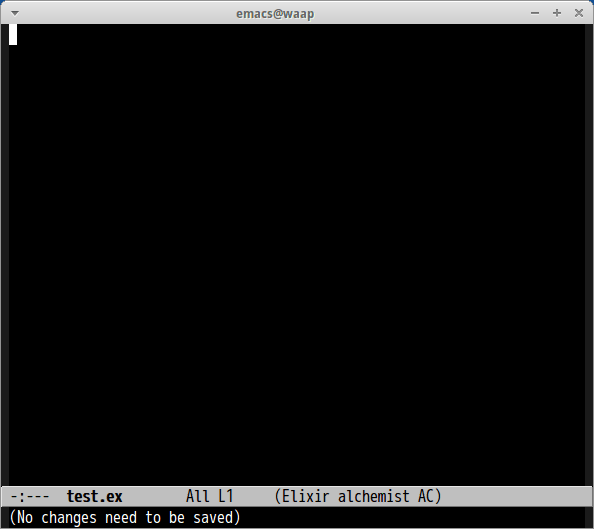

# ac-alchemist.el

[auto-complete](https://github.com/auto-complete/auto-complete/) source for [Alchemist](https://github.com/tonini/alchemist.el)


## Screenshot




## NOTE

**THIS IS EXPERIMENTAL**

alchemist.el frequently changes its interfaces. Please report me if ac-alchemist does not work.
I test only with latest alchemist.el. Please upgrade alchemist.el and test before reporting me.


## Sample Configuration

```lisp
(add-hook 'elixir-mode-hook 'ac-alchemist-setup)
```
